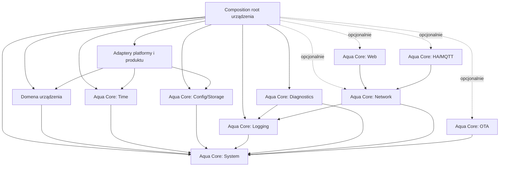

# Aqua Core — kontrakt architektoniczny

**Status:** AC0 zatwierdzony; **AC1–AC8 IMPLEMENTED**  
**Zakres:** LumaSense jako pierwszy konsument; AquaDoser jako drugi planowany konsument  
**Charakter dokumentu:** wymagania oznaczone słowami **MUSI**, **NIE MOŻE** i **POWINIEN** są wiążące dla kolejnych etapów.

## 1. Cel i granice Aqua Core

Aqua Core ma być małą biblioteką współdzielonych usług technicznych dla autonomicznych urządzeń ekosystemu. Nie jest centralnym „mózgiem”, wspólnym firmware ani warstwą domenową urządzeń. Każde urządzenie zachowuje własny punkt wejścia, kompozycję zależności, logikę sterowania, konfigurację domenową, testy, wersję i proces wydania.

Podstawowa funkcja urządzenia MUSI działać bez Wi-Fi, Internetu, Home Assistant, MQTT i innych urządzeń. Awaria opcjonalnego modułu Aqua Core NIE MOŻE zatrzymać lokalnego sterowania. Moduły sieciowe są dodatkiem do działającego urządzenia, a nie warunkiem jego pracy.

Aqua Core może znać wyłącznie pojęcia techniczne niezależne od urządzenia, na przykład monotoniczny czas systemowy, UTC, źródła czasu, rekord trwałego zapisu, wersję schematu, log, stan diagnostyczny, połączenie sieciowe i aktualizację firmware. Nie może znać kanałów światła, PWM, pomp, dawek, karmienia, temperatury akwarium, poziomu wody, CO2, masy, ciśnienia, profili oświetlenia ani algorytmów regulacji.

Aqua Core **nigdy nie importuje klas domenowych urządzenia**. Dotyczy to także pozornie wygodnych zależności od `DeviceConfig`, `ChannelConfig`, `Profile`, `ChannelLevels`, `ModeManager`, `LumaCore` lub przyszłych klas AquaDoser. Jeżeli usługa techniczna potrzebuje danych albo akcji urządzenia, otrzymuje neutralny typ, callback lub mały interfejs zdefiniowany po stronie Aqua Core. Adapter i kompozycja pozostają w firmware urządzenia.

## 2. Klasyfikacja obecnego kodu LumaSense

### A. Kandydaci do Aqua Core

| Obszar obecny | Kandydat docelowy | Warunek wydzielenia |
|---|---|---|
| `RtcService` | sterownik/źródło UTC dla DS3231 | Piny i magistrala I2C muszą być przekazane przez konfigurację techniczną; brak `BuildConfig` LumaSense. |
| `NtpService`, `NtpBackend` | opcjonalne źródło czasu NTP | Brak zależności od stałych LumaSense i od konkretnej implementacji RTC; synchronizacja przez neutralny odbiornik UTC. |
| techniczna część `TimeTypes` | `UtcDateTime`, wyniki i status źródła czasu | Typy nie mogą zawierać pojęć profilu ani trybu urządzenia. |
| techniczna część `TimeService` | koordynacja źródeł UTC i konwersja strefy | Strefa czasu jest parametrem urządzenia. `Europe/Warsaw` pozostaje ustawieniem LumaSense. |
| mechanizm dwóch rekordów w `StorageService` | atomowy/versionowany magazyn bajtów | Biblioteka nie zna `DeviceConfig` ani jego walidatora; zapisuje jawny payload i metadane. |
| CRC32, numer generacji, nagłówek rekordu | prymitywy Config/Storage | Format ma być neutralny i testowany niezależnie od konfiguracji urządzenia. |
| brakujące dziś usługi startu, logowania i diagnostyki | moduły System, Logging, Diagnostics | Muszą pozostać małe, opcjonalne i niezależne od domeny. |

To są kandydaci do adaptacji, nie pliki do bezpośredniego skopiowania. Obecny `StorageService` zna `DeviceConfig` i `ConfigValidator`; `TimeService` posiada konkretny `RtcService` i strefę Warsaw; `RtcService` pobiera piny z `BuildConfig`; `NtpService` zna stałe projektu. Te zależności trzeba przeciąć adapterami w kolejnych etapach.

### B. Elementy pozostające w LumaSense

- `LumaCore` i `FirmwareApp` — kompozycja oraz zachowanie konkretnego urządzenia.
- `LightEngine` — domenowy pipeline światła, gamma, kalibracja, limit mocy i `hardMaxPercent`.
- `DayEngine`, `Profile`, `DayStage`, `ChannelLevels` — model i harmonogram oświetlenia.
- `ModeManager` oraz tryby OFF, CHANNEL_TEST, MANUAL, PREVIEW, SIMULATION, SERVICE i NORMAL — lokalna polityka sterowania LumaSense.
- `TransitionEngine` — przejścia wartości kanałów światła; typ `ChannelLevels` wiąże go z domeną.
- `DeviceConfig`, `ChannelConfig`, `TankConfig`, profile, `ConfigValidator` i `ConfigDefaults` — schemat i reguły produktu.
- `HardwareInterface`, `Lolin32Hardware`, `AqmaHardware` — mimo ogólnej nazwy interfejs opisuje osiem kanałów oświetlenia i procentowe PWM.
- Preview, Simulation, ChannelTest, rozpoznawanie DAY/NIGHT i reakcje na zmianę profilu.

### C. Elementy, których jeszcze nie uogólniamy

`ModeManager`, `TransitionEngine`, `DayEngine`, Simulation, ChannelTest, domenowe tryby oraz `TankConfig` pozostają lokalne co najmniej do czasu poznania rzeczywistych wymagań drugiego urządzenia. Podobieństwo nazw nie jest wystarczającym dowodem wspólnego kontraktu. AquaDoser może ujawnić potrzebę innych priorytetów, trwałych zdarzeń, czasu wykonania i odzyskiwania po restarcie. Wcześniejsze uogólnienie utrwaliłoby założenia oświetlenia w API biblioteki.

## 3. Docelowa struktura katalogów i repozytoriów

Pierwsze wersje powstają wewnątrz repozytorium LumaSense, aby migracja była mała i odwracalna:

```text
lib/
  aqua_core/
    system/
    time/
    config/
    logging/
    diagnostics/
    network/          # później
    web/              # później
    mqtt_ha/          # później
    ota/              # później
src/
  lumasense/
    app/
    core/
    light/
    profiles/
    hardware/
    config/
```

W AC0 niczego nie przenosimy. Struktura jest kierunkiem dla AC1–AC9, nie poleceniem jednorazowej reorganizacji. Nie powstaje zbiorczy `AquaCore.cpp` ani obowiązkowy obiekt uruchamiający wszystkie moduły.

Po sprawdzeniu kontraktów przez co najmniej LumaSense i AquaDoser biblioteka może otrzymać osobne repozytorium `aqua-core`. Każde firmware pozostaje w osobnym repozytorium i przypina konkretną wersję biblioteki. Przeniesienie do osobnego repozytorium następuje dopiero, gdy granice modułów są stabilne i istnieją testy konsumentów.

## 4. Moduły i kolejność rozwoju

Pierwszy zakres Aqua Core obejmuje:

1. **System** — wynik inicjalizacji, bezpieczne statusy i podstawowe informacje o uruchomieniu.
2. **Time** — neutralne UTC, źródła RTC/NTP, status wiarygodności i parametryzowana konwersja strefy.
3. **Config/Storage** — neutralny, atomowy zapis payloadu z CRC, generacją i wersją schematu.
4. **Logging** — wspólne poziomy oraz neutralny odbiornik logów.
5. **Diagnostics** — agregacja jawnych statusów modułów bez przejmowania sterowania.

Później, w osobnych wersjach i jako moduły opcjonalne, mogą dojść Network, Web, HA/MQTT oraz OTA. Scheduler, trwałe zdarzenia, EventLog i ewentualne wspólne pomocniki trybów mogą być rozważane dopiero podczas AquaDoser, kiedy pojawią się konkretne wymagania wykonania dawek i odzyskiwania po restarcie.

## 5. Kontrakty modułów

Każdy moduł ma osobny interfejs, cykl życia i status. Urządzenie wybiera moduły w composition root; brak modułu jest poprawną konfiguracją.

### 5.1 System

- **Odpowiedzialność:** neutralny kontrakt `begin/update`, kody wyniku startu, identyfikacja wersji firmware/core/schema i monotoniczny czas przekazany przez platformę.
- **Nie odpowiada za:** kolejność domenowego startu, bezpieczne wyjścia, watchdog procesu technologicznego ani decyzję, czy urządzenie może sterować.
- **Wejście:** jawna konfiguracja techniczna i abstrakcje platformy.
- **Wyjście:** wynik inicjalizacji i status techniczny.
- **Dozwolone zależności:** platform adapter, Logging; bez domeny urządzenia.
- **Status diagnostyczny:** `NotConfigured`, `Starting`, `Ready`, `Degraded`, `Failed` oraz kod przyczyny.

### 5.2 Time

- **Odpowiedzialność:** reprezentacja UTC, walidacja odczytu RTC, odświeżanie wiarygodności, opcjonalna synchronizacja NTP, wybór wiarygodnego źródła oraz konwersja do lokalnego czasu według przekazanej reguły/strefy.
- **Nie odpowiada za:** harmonogram światła, dawki, profile, decyzje DAY/NIGHT ani reakcję urządzenia na nieważny czas.
- **Wejście:** źródła UTC, monotoniczny `nowMs`, konfiguracja strefy i polityka synchronizacji.
- **Wyjście:** czas UTC/lokalny, flaga ważności, źródło, wiek i kod błędu.
- **Dozwolone zależności:** System, Logging, neutralny sterownik I2C/NTP.
- **Status diagnostyczny:** dostępność RTC, OSF/validity, ostatni poprawny odczyt i synchronizacja; brak czasu jest stanem raportowanym, nie wyjątkiem zatrzymującym firmware.

### 5.3 Config/Storage

- **Odpowiedzialność:** atomowy zapis i odczyt nieprzezroczystego payloadu, CRC, generacja rekordu, wybór poprawnej kopii i numer schematu.
- **Nie odpowiada za:** znaczenie pól, wartości domyślne ani walidację `DeviceConfig`. Te należą do firmware konsumenta.
- **Wejście:** bufor/serializowany rekord urządzenia, rozmiar, schema version i backend pamięci.
- **Wyjście:** payload oraz wynik `Ok`, `NotFound`, `Corrupt`, `SchemaMismatch`, `IoError`.
- **Dozwolone zależności:** System, Logging, neutralny backend pamięci.
- **Status diagnostyczny:** aktywny slot, generacja, schema, wynik ostatniej operacji; żadnych sekretów ani pełnego payloadu w logu.

### 5.4 Logging

- **Odpowiedzialność:** poziomy logowania, znacznik czasu/uptime, kategoria i wymienny sink.
- **Nie odpowiada za:** przechowywanie historii zdarzeń procesowych, telemetrię ani podejmowanie decyzji.
- **Wejście:** poziom, kategoria, kod i krótki komunikat.
- **Wyjście:** wpis do skonfigurowanego sinka; brak sinka jest poprawny.
- **Dozwolone zależności:** System/clock; sink platformowy implementuje urządzenie.
- **Status diagnostyczny:** liczba odrzuconych wpisów i stan sinka. Logowanie nigdy nie blokuje podstawowego sterowania.

### 5.5 Diagnostics

- **Odpowiedzialność:** zbieranie snapshotów statusu z jawnie zarejestrowanych modułów i prezentowanie stanu ogólnego.
- **Nie odpowiada za:** recovery domenowe, zmianę trybu, restart urządzenia ani ukryte sterowanie modułami.
- **Wejście:** neutralne statusy i liczniki.
- **Wyjście:** snapshot do lokalnego UI, logu lub telemetrii.
- **Dozwolone zależności:** System, Logging i interfejs dostawcy statusu.
- **Status diagnostyczny:** `Healthy`, `Degraded`, `Failed` z listą przyczyn; agregacja nie zmienia statusów źródłowych.

### 5.6 Network — moduł późniejszy i opcjonalny

- **Odpowiedzialność:** stan połączenia, ponawianie z ograniczeniem, dane IP i zdarzenia dostępności.
- **Nie odpowiada za:** captive portal produktu, konfigurację domenową ani warunek działania sterowania.
- **Wejście:** poświadczenia przez bezpieczny adapter, polityka retry, backend sieciowy.
- **Wyjście:** stan `Disabled/Disconnected/Connecting/Connected/Failed`.
- **Dozwolone zależności:** System, Logging, Diagnostics.
- **Status diagnostyczny:** ostatni błąd, liczba prób i czas ostatniego połączenia.

### 5.7 Web — moduł późniejszy i opcjonalny

- **Odpowiedzialność:** neutralny serwer HTTP, routing techniczny, uwierzytelnienie i transport DTO.
- **Nie odpowiada za:** formularze profili LumaSense, formularze dawek AquaDoser ani bezpośrednie modyfikowanie domeny.
- **Wejście:** zarejestrowane endpointy/adapters urządzenia i snapshot diagnostyczny.
- **Wyjście:** odpowiedzi HTTP i jawne komendy przekazane adapterowi aplikacji.
- **Dozwolone zależności:** Network, System, Logging, Diagnostics.
- **Status diagnostyczny:** stan serwera, liczba aktywnych żądań i ostatni błąd transportu.

### 5.8 HA/MQTT — moduł późniejszy i opcjonalny

- **Odpowiedzialność:** połączenie z brokerem, publikacja neutralnych wiadomości, subskrypcje i opcjonalne discovery przez adapter urządzenia.
- **Nie odpowiada za:** prawdę źródłową stanu urządzenia, tryby domenowe ani gwarancję działania procesu.
- **Wejście:** konfiguracja brokera, jawnie zarejestrowane encje/tematy i callback komend.
- **Wyjście:** zdarzenia transportowe i dostarczenie komendy do aplikacji.
- **Dozwolone zależności:** Network, System, Logging, Diagnostics.
- **Status diagnostyczny:** stan połączenia, kolejka, liczba błędów; brak brokera nie blokuje urządzenia.

### 5.9 OTA — moduł późniejszy i opcjonalny

- **Odpowiedzialność:** weryfikacja artefaktu, zapis do nieaktywnej partycji i wynik aktualizacji.
- **Nie odpowiada za:** samodzielną zgodę na aktualizację ani decyzję o bezpiecznym momencie restartu.
- **Wejście:** strumień obrazu, metadane, podpis/hash i zgoda aplikacji.
- **Wyjście:** postęp i jednoznaczny wynik; restart jest osobną decyzją composition root.
- **Dozwolone zależności:** Network opcjonalnie, System, Logging, Diagnostics, adapter flash.
- **Status diagnostyczny:** bieżąca faza, wersja kandydata i ostatni błąd.

## 6. Lokalne tryby urządzenia a zdarzenia ekosystemu

Tryb jest lokalnym, trwałym stanem arbitrażu wyjść konkretnego urządzenia. Zdarzenie ekosystemu jest neutralnym faktem lub intencją przekazaną przez transport; nie jest zdalną zmianą wewnętrznego enum trybu. Aqua Core nie definiuje wspólnego `ModeManager`.

Przykład: LumaSense może mieć lokalny tryb SERVICE, a AquaDoser lokalny FEEDING lub blokadę dozowania. Komunikat `feeding.started` nie nakazuje obu urządzeniom wejść w identyczny tryb. Każde firmware mapuje go własnym adapterem i może go zignorować zgodnie z lokalną polityką.

| Zdarzenie | LumaSense | AquaDoser |
|---|---|---|
| `feeding.started` | może przygasić światło albo nic nie zrobić | może lokalnie wstrzymać dawkę według własnych reguł |
| `feeding.ended` | może wrócić do poprzedniego lokalnego sterowania | może wznowić kwalifikowanie przyszłych dawek |
| utrata MQTT | utrzymuje lokalny harmonogram | utrzymuje lokalny scheduler i politykę bezpieczeństwa |

W AC0 nie powstaje EventBus. Dopóki nie istnieją co najmniej dwa realne przypadki komunikacji, wystarczają jawne callbacki i adaptery transportu. Ewentualny przyszły katalog zdarzeń opisuje nazwę, wersję payloadu, źródło i semantykę; nie współdzieli obiektów domenowych.

## 7. Kryteria wejścia do Aqua Core

Element może wejść do biblioteki wyłącznie wtedy, gdy wszystkie odpowiedzi są twierdzące:

1. Rozwiązuje ten sam techniczny problem w co najmniej dwóch urządzeniach albo jest niezbędnym fundamentem zatwierdzonego modułu 0.1.
2. Jego publiczny kontrakt nie używa pojęć jednej domeny.
3. Daje się testować bez uruchamiania firmware konkretnego urządzenia.
4. Ma jawne wejścia, wyjścia, status błędu i zachowanie przy braku zależności opcjonalnych.
5. Nie odbiera urządzeniu autonomii ani lokalnej decyzji o bezpiecznym zachowaniu.
6. Nie wymusza zależności wszystkich konsumentów od modułów, których nie używają.
7. Koszt stabilizacji API jest mniejszy niż koszt dwóch lokalnych implementacji.

Obowiązuje zasada: **nie dodajemy elementu „bo może się kiedyś przydać”**. Najpierw powstaje drugi konkretny przypadek użycia, potem najmniejszy wspólny kontrakt. Duplikacja przez krótki czas jest dopuszczalna, jeśli chroni przed błędną abstrakcją.

## 8. Niezależne wersjonowanie

Obowiązują trzy niezależne osie wersji:

- **Aqua Core:** Semantic Versioning `MAJOR.MINOR.PATCH`. MAJOR zmienia niezgodny publiczny kontrakt, MINOR dodaje zgodną funkcję, PATCH naprawia zachowanie bez zmiany kontraktu.
- **Firmware urządzenia:** własne SemVer, niezależne od wersji Aqua Core. Wersja LumaSense nie wynika z wersji biblioteki.
- **Schemat konfiguracji:** rosnąca liczba całkowita zapisana z rekordem. Zmiana schematu wymaga jawnej migracji albo kontrolowanego odrzucenia i użycia wartości domyślnych.

Artefakt diagnostyczny i ekran informacji powinny pokazywać wszystkie trzy wartości. Zmiana implementacji bez zmiany układu konfiguracji nie podnosi wersji schematu. Podniesienie wersji Aqua Core nie wymusza podniesienia MAJOR firmware.

## 9. Przypinanie zależności

Każdy projekt MUSI wskazywać dokładną, niezmienną wersję Aqua Core: tag, release archive z sumą albo pełny commit SHA. Niedozwolone są `latest`, niezablokowane `main`, zakres wersji automatycznie pobierający nowsze MINOR/PATCH oraz lokalna zależność wskazująca przypadkowy stan roboczy.

Aktualizacja Aqua Core jest osobną zmianą w firmware: ma opis zmian, wynik testów modułu i regresji urządzenia oraz możliwość prostego cofnięcia do poprzedniego przypięcia. Plik lock lub równoważny zapis wersji trafia do repozytorium urządzenia.

## 10. Model Git i wydań

Dla Aqua Core i każdego firmware obowiązuje:

- `main` zawiera wyłącznie stan wydawalny i jest chroniony;
- `develop` integruje zatwierdzone zmiany następnego wydania;
- `feature/<zakres>` powstaje z `develop` i wraca przez przegląd;
- `fix/<zakres>` służy poprawkom bieżącego rozwoju; pilny hotfix może wyjść z `main`, ale po wydaniu musi wrócić także do `develop`;
- wydania Aqua Core mają tag `vMAJOR.MINOR.PATCH`, a firmware własny tag produktu, na przykład `lumasense-vMAJOR.MINOR.PATCH`;
- tag tworzy się z `main` dopiero po testach, przeglądzie zmian publicznego API i przygotowaniu notatek wydania;
- merge do `main` jest jawny, bez bezpośredniego rozwijania funkcji na tej gałęzi.

Wydanie biblioteki poprzedza aktualizację konsumenta. Firmware wskazuje opublikowany tag/commit, przechodzi własne testy i dopiero wtedy otrzymuje wydanie.

## 11. Minimalna mapa wersji

### Aqua Core 0.1

- neutralne typy wyniku i statusu System;
- Time: UTC, kontrakt źródła czasu, stan ważności, adapter DS3231 i parametryzowana strefa;
- Config/Storage: backend bajtowy, dwa rekordy, CRC, generacja i schema version bez `DeviceConfig`;
- minimalny Logging z wymiennym sinkiem;
- minimalny Diagnostics agregujący statusy.

### Aqua Core 0.2

- opcjonalny Network z jawnie raportowanym stanem i nieblokującym retry;
- stabilizacja kontraktów 0.1 na podstawie pracy LumaSense;
- lokalny endpoint diagnostyczny może powstać jako adapter, jeśli nie wciąga domeny do biblioteki.

### Aqua Core 0.3

- opcjonalne Web, HA/MQTT i OTA jako oddzielne moduły;
- kontrakty rejestracji DTO/komend pozostają po stronie urządzenia;
- żaden z modułów nie staje się zależnością System, Time ani Config/Storage.

### AquaDoser

AquaDoser najpierw używa tylko potrzebnego podzbioru stabilnych modułów. Jego domena powstaje lokalnie. Dopiero rzeczywiste wymagania dozowania mogą uruchomić projektowanie schedulera, trwałych zdarzeń i EventLog. Zmiana Aqua Core wynikająca z AquaDoser musi nadal zachować LumaSense jako równorzędnego konsumenta.

## 12. Zakres świadomie odłożony do AquaDoser

Nie projektujemy teraz:

- schedulera dawek ani ogólnego schedulera czasu rzeczywistego;
- semantyki exactly-once;
- odzyskiwania niedokończonej dawki po restarcie;
- trwałej historii dozowania;
- polityki missed events;
- wspólnego zdarzenia FEEDING ani katalogu zdarzeń między urządzeniami;
- trwałego EventLog;
- wspólnych helperów trybów i priorytetów.

Te elementy wymagają decyzji o idempotencji, identyfikatorach zdarzeń, oknie czasowym, bezpieczeństwie aktuatora i zachowaniu po utracie zasilania. LumaSense nie dostarcza wystarczających danych, aby ustalić poprawny kontrakt. Są dopuszczalne dopiero po zapisaniu przypadków AquaDoser i testów awarii.

## 13. Plan migracji AC1–AC9

Migracja jest sekwencyjna. Po każdym etapie repozytorium ma pozostać uruchamialne. Każdy etap kończy się buildem obu wariantów LumaSense, testami modułowymi i pełną dostępną regresją; test fizyczny wykonuje się, gdy zmiana dotyka platformy, czasu, pamięci, sieci lub wyjść.

| Etap | Zakres | Warunek zakończenia |
|---|---|---|
| **AC1** | Utworzenie szkieletu `lib/aqua_core`, przestrzeni nazw, zasad include i neutralnych typów `Result/ModuleStatus/VersionInfo`. Bez migracji zachowania. | Oba buildy LumaSense i wszystkie testy regresyjne przechodzą; brak zależności zwrotnej. |
| **AC2** | Minimalny Logging; adapter Serial pozostaje w LumaSense. | Wyłączenie modułu nie zmienia sterowania; test filtrowania i błędów sinka. |
| **AC3** | Neutralne typy UTC oraz techniczna implementacja DS3231/NTP bez BuildConfig i domeny LumaSense. | Testy RTC/NTP/DST i invalid→valid; fizyczny test DS3231. |
| **AC4** | Neutralny backend Config/Storage: payload, dwa sloty, CRC, generacja i schema. DeviceConfig, walidator i defaults pozostają w LumaSense. | Test korupcji, uciętego zapisu, niezgodnego schematu, rollover i fallbacku. |
| **AC5** | Minimalny read-only Diagnostics agregujący System, Time i Config/Storage. | Snapshot nie steruje usługami; testy health, niezależności i braku skutków ubocznych. |
| **AC6** | Minimalny Network: niezależne STA/AP, backend ESP32 i nieblokujący reconnect. Bez integracji z domeną LumaSense. | Test state machine, rollover, niezależności usług i opcjonalnego NetworkDiagnostics. |
| **AC7** | Opcjonalny Network bez Web/MQTT; retry nie blokuje pętli urządzenia. | Sterowanie pozostaje poprawne przy braku AP, błędnym haśle, zrywaniu połączenia i millis overflow. Kandydat 0.2. |
| **AC8** | Opcjonalne Web oraz HA/MQTT przez adaptery LumaSense. UI i DTO domenowe pozostają lokalne. | Odłączenie serwera/brokera nie wpływa na harmonogram; autoryzacja i walidacja komend; test 24–72 h offline. |
| **AC9** | Opcjonalne OTA, stabilizacja pakowania i próbne użycie wybranego podzbioru przez szkielet AquaDoser. | Weryfikacja obrazu, kontrolowany rollback/restart, przypięte wersje; brak wymuszonych modułów. Kandydat 0.3. |

W jednym etapie nie przenosi się kilku niezależnych usług. Adapter zgodności może istnieć przez jeden lub kilka etapów. Usunięcie starej ścieżki następuje dopiero po przejściu porównawczych testów i nie może być połączone z refaktorem domeny.

## 14. Strategia testów i bramy wydania

Każdy moduł Aqua Core otrzymuje testy hostowe tam, gdzie to możliwe, oraz testy adaptera platformowego na ESP32. Minimalne zestawy obejmują:

- **System:** kolejność stanów, częściowy błąd inicjalizacji, wielokrotne `begin`, overflow czasu monotonicznego.
- **Time:** poprawne i błędne BCD, zakresy kalendarza, OSF podczas startu i pracy, I2C error, DST/strefa, NTP timeout, skok czasu i overflow `millis()`.
- **Config/Storage:** oba sloty, generacje z overflow, CRC, ucięty zapis, brak rekordu, nieznany schema version, migracja i błąd backendu.
- **Logging:** brak sinka, filtr poziomu, przepełnienie, reentrancy zgodnie z wybranym kontraktem i brak blokowania pętli.
- **Diagnostics:** agregacja `Ready/Degraded/Failed`, znikający provider i snapshot bez skutków ubocznych.
- **Network/Web/MQTT/OTA:** awarie, timeouty, reconnect bez busy loop, błędne dane wejściowe, zerwanie transmisji i wyłączenie modułu.

Każda zmiana biblioteki uruchamia testy samego Aqua Core i testy wszystkich przypiętych konsumentów. Każde wydanie firmware zachowuje istniejące testy domenowe LumaSense, w szczególności ModeManager, transitions, DayEngine, Simulation, RTC, walidację, LightEngine, Preview, skoki czasu, NTP i Storage.

**Obowiązkowa brama przed wydaniem:** co najmniej jeden egzemplarz docelowego urządzenia pracuje przez **24–72 godziny całkowicie offline** — bez Wi-Fi, Internetu, MQTT i Home Assistant. W tym czasie podstawowe sterowanie, RTC/lokalny harmonogram, restart po zaniku zasilania i bezpieczny stan wyjść muszą działać. Dla zmian Storage/OTA test obejmuje kontrolowany restart i utratę zasilania w zaplanowanych punktach. Wynik oraz wersje firmware/core/schema są zapisane w protokole wydania.

## 15. Kontrakt Web UI

Web UI należy do produktu. Aqua Core może dostarczyć transport HTTP, routing techniczny, mechanizm sesji oraz neutralny endpoint diagnostyczny, ale nie dostarcza wspólnego panelu sterowania urządzeniami.

- Formularze profili, kanałów i trybów LumaSense pozostają w repozytorium LumaSense.
- Formularze dawek, pomp i kalibracji AquaDoser pozostają w repozytorium AquaDoser.
- Każdy endpoint domenowy mapuje DTO na komendę aplikacji, która waliduje dane przed zmianą stanu.
- UI nie zapisuje bezpośrednio obiektu w Storage i nie wywołuje sprzętu.
- Zerwanie klienta, błąd JavaScript lub brak Web nie wpływa na pętlę sterowania.
- Publiczny transport ma wersjonowane DTO i jawne odpowiedzi błędu; nie serializuje surowej pamięci struktur C++.
- Dane diagnostyczne są tylko odczytem snapshotu. Operacje restartu, OTA i resetu konfiguracji wymagają osobnych, autoryzowanych komend produktu.

## 16. Kierunek zależności

Strzałka oznacza „zależy od”:



Dozwolona zależność biegnie z aplikacji lub domeny do publicznego kontraktu Aqua Core. Implementacje platformowe mogą implementować interfejsy biblioteki, lecz biblioteka nie importuje ich nagłówków. **Nie istnieje strzałka z Aqua Core do LumaSense, AquaDoser ani ich typów.**

Moduły opcjonalne zależą od małych modułów bazowych, a nie odwrotnie: System, Time oraz Config/Storage nie mogą zależeć od Network, Web, MQTT ani OTA. Domena nie komunikuje się przez globalny singleton Aqua Core. Composition root tworzy obiekty i przekazuje jawne referencje.

## 17. Reguły STOP

Pracę należy zatrzymać i wrócić do kontraktu, jeżeli zmiana wymaga któregokolwiek z poniższych działań:

- przeniesienia `LumaCore`, `ModeManager`, `TransitionEngine`, `LightEngine`, `DayEngine`, profili, kanałów lub PWM do Aqua Core;
- nazwania domenowego typu „generic” bez drugiego konsumenta;
- dodania wspólnego Schedulera, EventBus, EventLog lub wspólnych trybów przed wymaganiami AquaDoser;
- utworzenia monolitycznego `AquaCore` inicjalizującego wszystkie usługi;
- obowiązkowego włączenia Network, Web, MQTT, HA lub OTA;
- uzależnienia podstawowej pętli sterowania od łączności albo sukcesu telemetrii;
- importu nagłówka urządzenia przez katalog Aqua Core;
- połączenia migracji technicznej z dużym refaktorem domeny;
- zmiany wielu modułów w jednym etapie bez niezależnych testów i punktu wycofania;
- zapisania konfiguracji urządzenia jako surowego, nieprzenośnego ABI biblioteki.

Wyjątek wymaga aktualizacji tego kontraktu, konkretnego przypadku z co najmniej dwóch urządzeń oraz osobnego przeglądu architektury.

## 18. Granice najbliższych prac

### ROBIMY TERAZ

- kończymy AC0 jako zatwierdzony kontrakt;
- w AC1 tworzymy jedynie szkielet modułów, przestrzeń nazw i neutralne typy wyniku/statusu;
- utrzymujemy LumaSense w stanie kompilowalnym i testowalnym po każdej małej zmianie;
- przygotowujemy adaptery, zanim usuniemy obecne ścieżki.

### ODKŁADAMY

- Network do 0.2;
- Web, HA/MQTT i OTA do 0.3;
- osobne repozytorium do czasu sprawdzenia API przez drugi produkt;
- scheduler, exactly-once, restart recovery, dose history, missed events, feeding events, EventLog i wspólne pomocniki trybów do prac nad AquaDoser.

### NIE RUSZAMY

- domenowego rdzenia LumaSense i jego priorytetów trybów;
- `TransitionEngine`, `LightEngine`, `DayEngine`, profili i Simulation;
- pipeline PWM, polaryzacji i klas hardware;
- znaczenia `DeviceConfig`, walidatora i wartości domyślnych w ramach AC0;
- produkcyjnego kodu, konfiguracji PlatformIO i testów w ramach tego etapu.

## 19. Lista kontrolna audytu architektury

Każdy etap i pull request dotyczący Aqua Core przechodzi tę listę:

| Pytanie | Wymagany wynik | Uzasadnienie |
|---|---|---|
| Czy Aqua Core importuje typ lub nagłówek LumaSense/AquaDoser? | Nie | Chroni kierunek zależności. |
| Czy urządzenie nadal buduje się i działa bez niewybranych modułów? | Tak | Zapobiega monolitowi i wymuszonym modułom. |
| Czy Network/Web/MQTT/HA/OTA można wyłączyć bez zmiany domeny? | Tak | Zachowuje autonomię offline. |
| Czy podstawowe sterowanie działa 24–72 h bez łączności? | Tak przed wydaniem | Potwierdza odporność w realnych warunkach. |
| Czy AquaDoser może użyć tylko potrzebnego podzbioru? | Tak | Biblioteka ma być modułowa. |
| Czy publiczne API zawiera światło, pompę, dawkę, feeding lub tryb produktu? | Nie | Domena pozostaje w firmware. |
| Czy nowa abstrakcja ma dwa rzeczywiste przypadki użycia lub należy do zatwierdzonego fundamentu 0.1? | Tak | Blokuje projektowanie „na przyszłość”. |
| Czy błąd modułu ma jawny status i bezpieczne zachowanie? | Tak | Ułatwia diagnostykę bez ukrytego sterowania. |
| Czy wersje Core, firmware i schema są niezależne oraz raportowane? | Tak | Umożliwia kontrolowane wydania i migracje. |
| Czy zależność Aqua Core jest przypięta dokładnie? | Tak | Zapewnia powtarzalne buildy. |
| Czy etap ma test modułu, regresję konsumenta i punkt wycofania? | Tak | Utrzymuje migrację przyrostową. |
| Czy dokumentacja Web oddziela transport od DTO i komend produktu? | Tak | Nie przenosi domeny do biblioteki. |
| Czy zmiana tworzy centralny obiekt sterujący urządzeniem? | Nie | Aqua Core pozostaje zestawem usług. |

Audyt AC0 spełnia te warunki na poziomie projektu: nie zakłada zależności zwrotnej, nie tworzy monolitu, nie wymusza modułów sieciowych, zachowuje autonomię urządzeń, pozwala AquaDoser wybrać podzbiór i dzieli migrację na weryfikowalne kroki AC1–AC9.

## 20. Stan implementacji AC1

**AC1 IMPLEMENTED** — pierwsza wersja biblioteki ma numer **0.1.0**. Etap nie przeniósł żadnej istniejącej usługi LumaSense i nie zmienił jej logiki domenowej.

### 20.1 Zaimplementowana struktura

```text
lib/aqua_core/
  library.json
  include/AquaCore/
    Version.h
    System/
      DeviceIdentity.h
      RestartReason.h
      SystemBackend.h
      SystemService.h
  src/System/
    DeviceIdentity.cpp
    RestartReason.cpp
    Esp32RestartReason.h
    Esp32RestartReason.cpp
    SystemService.cpp
test/test_ac1/
  test_main.cpp
```

Biblioteka jest wykrywana przez PlatformIO jako osobna zależność `AquaCore 0.1.0`. Nie ma zbiorczego `AquaCore.cpp`. Publiczne nagłówki nie importują LumaSense ani typów ESP-IDF.

### 20.2 Wersja Aqua Core

`AquaCore/Version.h` definiuje niezależne od firmware LumaSense wartości:

```cpp
AQUA_CORE_VERSION_MAJOR  // 0
AQUA_CORE_VERSION_MINOR  // 1
AQUA_CORE_VERSION_PATCH  // 0
AQUA_CORE_VERSION        // "0.1.0"
```

### 20.3 DeviceIdentity

`AquaCore::DeviceIdentity` zawiera wyłącznie:

- `deviceType` — bufor 24 znaków,
- `deviceName` — bufor 32 znaków,
- `firmwareVersion` — bufor 24 znaków,
- `hardwareVariant` — bufor 32 znaków.

Konstruktor bezpiecznie kopiuje tekst, zawsze kończy bufor znakiem NUL i akceptuje `nullptr` jako pustą wartość. Nie używa dynamicznego `String`. Każdy `SystemService` przechowuje własną kopię identyfikacji.

### 20.4 RestartReason

Publiczny enum zawiera `Unknown`, `PowerOn`, `Software`, `Watchdog`, `Brownout`, `DeepSleep`, `Panic` i `Other`. Adapter ESP32 mapuje:

| ESP-IDF | Aqua Core |
|---|---|
| `ESP_RST_UNKNOWN` | `Unknown` |
| `ESP_RST_POWERON` | `PowerOn` |
| `ESP_RST_SW` | `Software` |
| `ESP_RST_INT_WDT`, `ESP_RST_TASK_WDT`, `ESP_RST_WDT` | `Watchdog` |
| `ESP_RST_BROWNOUT` | `Brownout` |
| `ESP_RST_DEEPSLEEP` | `DeepSleep` |
| `ESP_RST_PANIC` | `Panic` |
| pozostałe rozpoznane przez platformę | `Other` |

Typ `esp_reset_reason_t` nie występuje w publicznym API. Mapowanie platformowe znajduje się w prywatnym katalogu `src/System`.

### 20.5 SystemService

Publiczne API obejmuje:

```cpp
SystemService();
explicit SystemService(SystemBackend& backend);
bool begin(const DeviceIdentity& identity);
bool isReady() const;
uint32_t uptimeMs() const;
RestartReason restartReason() const;
const DeviceIdentity& deviceIdentity() const;
const char* aquaCoreVersion() const;
SystemStatus status() const;
```

`uptimeMs()` korzysta z 32-bitowego `millis()`. Różnice czasu zachowują poprawną semantykę modulo `uint32_t` przy rollover. Powód restartu jest pobierany podczas `begin()`. Backend umożliwia deterministyczne testy bez tworzenia ogólnej abstrakcji hardware.

LumaSense tworzy globalny `SystemService` i własny `DeviceIdentity`. `setup()` inicjalizuje usługę bez zmiany sterowania lampą, a istniejący startup log pokazuje dodatkowo wersję Aqua Core, wariant hardware i powód restartu. SystemService nie zarządza Wi-Fi, RTC, Storage, OTA, Web, MQTT ani logiką urządzenia.
## 21. Stan implementacji AC2

**AC2 IMPLEMENTED.** Moduł `AquaCore::Logging` dostarcza instancyjny `Logger`, poziomy `Debug/Info/Warning/Error/Off`, wymienny `LogSink` i `SerialLogSink(Print&)`. `AQUA_CORE_LOGGING_ENABLED` pozwala wyłączyć przekazywanie logów kompilacyjnie bez usuwania API. Nie dodano historii, NVS, ring buffera ani EventLog.

## 22. Stan implementacji AC3

**AC3 IMPLEMENTED.** Aqua Core ma wersję **0.2.0**, ponieważ otrzymał nowy publiczny moduł Time. Ta decyzja aktualizuje roboczą numerację roadmapy z sekcji 11; Network pozostaje modułem późniejszym i nie jest częścią 0.2.0.

### 22.1 Struktura Time

```text
lib/aqua_core/
  include/AquaCore/Time/
    EuropeWarsawTimeService.h
    NtpService.h
    RtcBus.h
    RtcService.h
    TimeConstants.h
    TimeTypes.h
  src/Time/
    EuropeWarsawTimeService.cpp
    NtpService.cpp
    RtcService.cpp
```

### 22.2 Zakres wspólny

Aqua Core zawiera typy `UtcDateTime` i `LocalTime`, ogólną walidację UTC, kompletną obsługę rejestrów DS3231, bieżącą kontrolę OSF, zweryfikowany `setUtc()`, nieblokujący NTP i konkretną konwersję Europe/Warsaw. `RtcBus` oddziela logikę DS3231 od platformowego I2C. NTP nie zależy od przyszłego modułu Network, a Time nie wymaga Loggera.

### 22.3 Zakres pozostający w LumaSense

W LumaSense pozostają piny z `BuildConfig`, adapter globalnego `Wire`, composition root oraz interpretacja czasu przez oświetlenie: wykrywanie skoków, tolerancja ±3 s, DAY/NIGHT, przejścia, profile i reakcja wyjść. Pliki `src/time` zachowują cienką zgodność nazw i delegują do Aqua Core; nie zawierają drugiej implementacji RTC lub NTP.

Europe/Warsaw jest obecnie jawnie nazwaną implementacją. Dynamiczna baza timezone i podłączenie pola konfiguracji strefy są odłożone. RTC przechowuje UTC, a NTP wyłącznie koryguje RTC.
## 23. Stan implementacji AC4

**AC4 IMPLEMENTED.** Aqua Core ma wersję **0.3.0** i zawiera niezależny od domeny moduł AquaCore::Config.

### 23.1 Struktura Config/Storage

Moduł zawiera publiczne pliki Crc32.h, PreferencesStorageBackend.h, StorageBackend.h, StorageRecord.h i StorageService.h oraz implementacje Crc32.cpp i StorageService.cpp.

StorageBackend ogranicza kontrakt do otwarcia przestrzeni nazw oraz odczytu i zapisu blobów. PreferencesStorageBackend jest lekkim adapterem produkcyjnego Preferences; parametr typu pozwala testom użyć mocka bez drugiej implementacji mechaniki storage. StorageService przechowuje dowolny payload i przyjmuje zewnętrzny PayloadValidator jako zwykły wskaźnik funkcji.

### 23.2 Granica domeny

Aqua Core zna wyłącznie bajty payloadu, jego długość i 16-bitowy numer schematu zapisany w rekordzie. Nie importuje kodu LumaSense i nie interpretuje schematu. DeviceConfig, ChannelConfig, Profile, TankConfig, ConfigValidator, ConfigDefaults oraz decyzja o użyciu defaults pozostają w LumaSense.

Lokalny LumaSense::StorageService zachowuje stare API i deleguje do AquaCore::Config::StorageService. Jego jedyną odpowiedzialnością jest podanie lokalizacji NVS, rozmiaru DeviceConfig, wersji jego schematu i domenowego adaptera walidacji.

### 23.3 Rekord i kompatybilność

Migracja zachowuje istniejący 24-bajtowy format rekordu, magic 0x4C534346, format version 1, little-endian, CRC payloadu, CRC pierwszych 20 bajtów nagłówka, 32-bitową generację oraz bezpieczne porównanie modulo uint32_t. Namespace lumasense i klucze cfg_a/cfg_b także się nie zmieniły. Rekordy NVS zapisane przed AC4 pozostają czytelne.

Zapis nadal trafia do przeciwnego slotu i jest aktywowany dopiero po pełnym odczycie zwrotnym, walidacji, sprawdzeniu generacji oraz porównaniu payloadu. Ucięty lub uszkodzony zapis nie narusza poprzedniej poprawnej kopii. Defaults i migracje schematu nie należą do Aqua Core i nie zostały dodane w AC4.
## 24. Stan implementacji AC5

**AC5 IMPLEMENTED.** Aqua Core ma wersję **0.4.0** i zawiera lekki moduł AquaCore::Diagnostics. Moduł tworzy value-object DiagnosticsSnapshot i nie zarządza żadną usługą.

### 24.1 Snapshot

DiagnosticsSnapshot zawiera trzy niezależne części:

- SystemDiagnostics: gotowość, DeviceIdentity, wersja Aqua Core, uptime i RestartReason;
- TimeDiagnostics: gotowość i ważność RTC, stan czasu, nazwa providera, dostępność i inicjalizacja NTP, trwająca synchronizacja, wynik ostatniej próby i opcjonalny wiek ostatniego sukcesu;
- StorageDiagnostics: gotowość backendu, obecność poprawnego payloadu, aktywny slot, generacja oraz wynik ostatniego load i save.

Wszystkie pola są typami prostymi, enumami albo buforami znakowymi o stałym rozmiarze. Moduł nie używa dynamicznego String.

### 24.2 HealthState

HealthState ma cztery wartości: Ok, Warning, Error i Unknown. OverallHealth wybiera najgorszy stan według jawnej kolejności Ok, Unknown, Warning, Error.

System jest Ok po poprawnym begin i Error przed gotowością. Czas jest Error, gdy RTC nie zostało zainicjalizowane; poprawne RTC daje Ok, a zainicjalizowane, lecz nieważne RTC daje Warning. Nieudana synchronizacja NTP przy nadal poprawnym RTC daje Warning, a przy nieważnym RTC podnosi stan do Error.

Storage jest Error, gdy backend nie jest gotowy lub ostatni save zakończył się błędem. Gotowy backend bez poprawnego payloadu daje Warning, ponieważ warstwa urządzenia może świadomie użyć defaults. Gotowy backend z poprawnym payloadem daje Ok; nieudany load przy zachowanym poprawnym rekordzie daje Warning.

### 24.3 Kontrakt read-only

DiagnosticsService otrzymuje stałe referencje do SystemService, RtcService i Config::StorageService, opcjonalny wskaźnik do NtpService oraz nazwę providera czasu przekazaną przez composition root. snapshot() wywołuje wyłącznie gettery const. Nie czyta RTC przez I2C, nie uruchamia ani nie odpytuje NTP i nie wykonuje operacji backendu Storage.

Diagnostics nie zna LumaSense, DeviceConfig ani klas domenowych. Nie zawiera Network, Wi-Fi, IP, RSSI, Web, MQTT, HA ani OTA. Przyszłe adaptery transportowe mogą czytać DiagnosticsSnapshot bez dodawania zależności zwrotnej i bez zmiany zachowania Diagnostics.
## 25. Stan implementacji AC6

**AC6 IMPLEMENTED.** Aqua Core ma wersję **0.5.0** i zawiera opcjonalny moduł AquaCore::Network. LumaSense nie tworzy jeszcze NetworkService w composition root, dlatego zachowanie lampy i jej start pozostają bez zmian.

### 25.1 Struktura Network

Publiczny moduł zawiera NetworkTypes, NetworkConfig, NetworkBackend, Esp32NetworkBackend oraz NetworkService. Publiczne API używa wyłącznie własnych enumów, stałych buforów znakowych, typów całkowitych i czterooktetowego IpAddress. Typy WiFiClass, wl_status_t, Arduino String i Arduino IPAddress nie opuszczają implementacji Esp32NetworkBackend.cpp.

NetworkBackend izoluje ustawienie hostname, rozpoczęcie STA, odczyt stanu, reconnect, disconnect, IP, RSSI oraz uruchomienie i zatrzymanie SoftAP. Mock backend pozwala testować state machine bez radia i bez globalnego stanu Wi-Fi.

### 25.2 Konfiguracja i STA/AP

NetworkConfig zawiera staEnabled, ssid, password, hostname, autoReconnect, reconnectIntervalMs, apEnabled, apSsid i apPassword. Wszystkie teksty mają stałe bufory i są sprawdzane pod kątem zakończenia NUL. Włączone STA wymaga SSID, a włączony AP wymaga AP SSID.

STA i AP mogą działać osobno albo równolegle. AP jest uruchamiany wyłącznie przez jawne apEnabled. AC6 nie dodaje captive portalu, DNS, automatycznego fallbacku AP, wielu sieci ani konfiguracji statycznego IP.

### 25.3 State machine i reconnect

NetworkState ma wartości Disabled, Idle, Connecting, Connected, Disconnected i Error. AccessPointState jest oddzielny i ma Disabled, Active oraz Error.

begin() tylko kopiuje i waliduje konfigurację, ustawia hostname oraz inicjuje żądane interfejsy. Nie odpytuje w pętli stanu, nie używa delay i nie czeka na połączenie. update(nowMs) odczytuje backend raz i aktualizuje stan oraz cache IP/RSSI.

Po wykryciu rozłączenia pierwsza próba reconnect następuje dopiero po reconnectIntervalMs, domyślnie 10 sekund. Kolejne próby mają ten sam odstęp. Odejmowanie czasu w uint32_t zachowuje poprawne działanie przy rollover millis. Licznik reconnectCount oznacza liczbę zainicjowanych prób. Błąd Wi-Fi nie wywołuje restartu i nie wpływa na System, Time, Storage ani sterowanie urządzenia.

### 25.4 Diagnostics

NetworkDiagnostics jest opcjonalną częścią DiagnosticsSnapshot. Raportuje state, STA enabled, connected, SSID, hostname, IP, RSSI, reconnectCount, uptime połączenia oraz stan AP. Brak NetworkService pozostawia network.available=false i networkHealth=Unknown, bez wpływu na dotychczasowy overallHealth.

Wyłączony Network i poprawnie działający jawny AP są Ok. Connecting i Idle są Unknown, a Disconnected lub Error dają najwyżej Warning. Brak Wi-Fi nie jest traktowany jako Error autonomicznego urządzenia.

### 25.5 Świadomie poza AC6

Moduł nie zawiera Web, MQTT, Home Assistant, captive portalu, DNS portalu, OTA, mDNS ani testu dostępności Internetu. Connected oznacza wyłącznie lokalne połączenie Wi-Fi.

## 26. Stan implementacji AC7

**AC7 IMPLEMENTED.** Aqua Core ma wersję **0.6.0** i zawiera lekki moduł `AquaCore::Web`. LumaSense nie tworzy jeszcze `WebService` ani `Esp32WebBackend` w composition root, dlatego zachowanie lampy i jej pętli pozostaje bez zmian.

### 26.1 Struktura i backend

Publiczna część modułu zawiera `WebTypes`, `WebConfig`, `WebBackend`, `Esp32WebBackend`, `WebService`, `WebPageProvider`, `WebApiProvider` i `HtmlShell`. `WebBackend` oddziela rejestrację tras, start, nieblokujące `update()`, zatrzymanie i obsługę 404 od biblioteki HTTP platformy.

Produkcyjny adapter używa standardowego `WebServer` z Arduino-ESP32. Jest on dostępny w obecnej platformie, obsługuje GET i POST oraz nie wymaga dodatkowej zależności. Typy `WebServer`, `HTTPMethod`, `String` i callbacki `std::function` pozostają wyłącznie w `Esp32WebBackend.cpp`. Publiczne kontrakty używają własnych enumów, widoku żądania ważnego podczas callbacku, wskaźnika funkcji z kontekstem oraz `WebResponseWriter`.

### 26.2 Routing i rozszerzenia urządzenia

`WebService` rejestruje wspólne trasy `GET /`, `GET /assets/aqua.css`, `GET /api/system`, `GET /api/diagnostics` oraz handler 404. Urządzenie może dodać własną trasę GET lub POST przez `addRoute()`, stronę przez `WebPageProvider` albo API przez `WebApiProvider`. Rejestry mają stałe limity, a callbacki nie używają `std::function` w publicznym API.

Provider strony podaje tylko `route()`, `title()` i strumieniuje zawartość przez `render()`. Shell pozostaje w Aqua Core, a znaczenie strony i jej treść pozostają w firmware urządzenia. Moduł nie importuje LumaSense, LightEngine, DeviceConfig ani żadnego typu domenowego.

### 26.3 Shell, nawigacja i zasoby

Wspólny shell HTML pobiera nazwę urządzenia, typ, wersję firmware i wariant sprzętu z `DeviceIdentity`, a wersję biblioteki z `SystemService`. Ma ciemny, responsywny układ z nagłówkiem, nawigacją, obszarem treści i stopką. `WebConfig::navigationMask` pozwala niezależnie włączyć Dashboard, Control, Automation, Settings, Diagnostics i System.

CSS jest osadzony jako stały zasób tylko do odczytu i udostępniony lokalnie. Nie ma CDN, fontów sieciowych, JavaScriptu ani zależności od Internetu. AC7 nie wymaga LittleFS ani SPIFFS.

### 26.4 API diagnostyczne i bezpieczeństwo

`/api/system` raportuje `DeviceIdentity`, wersję Aqua Core, uptime i powód restartu. `/api/diagnostics` serializuje read-only `DiagnosticsSnapshot`: ogólny health oraz części System, Time, Storage i opcjonalny Network. Brak `NetworkService` jest poprawnie raportowany jako `available=false`.

Serializator JSON jawnie escapuje cudzysłowy, backslash, znaki sterujące i podstawowe sekwencje specjalne. Tekst dynamiczny w HTML jest escapowany osobno. Endpointy nie otrzymują konfiguracji sieciowej i nie mają dostępu do haseł Wi-Fi/AP ani przyszłych tokenów. Web wywołuje tylko odczyt `DiagnosticsService::snapshot()` i getterów `SystemService`; nie steruje Network, nie zapisuje Storage i nie restartuje systemu.

### 26.5 Strategia pamięci i granice AC7

Odpowiedzi używają transferu chunked przez `WebResponseWriter`. Shell, CSS i JSON są wysyłane małymi fragmentami; nie powstaje wielokilobajtowy dynamiczny `String`. Statyczny CSS trafia do sekcji tylko do odczytu obrazu firmware. Rejestry tras i providerów mają stałe maksima. Adapter ESP32 alokuje tylko własną instancję standardowego serwera i ukryty rejestr backendu; obiekty różnych usług nie współdzielą stanu globalnego.

`update()` wykonuje pojedyncze `handleClient()` i nie zawiera `delay`, oczekiwania na Wi-Fi ani reconnectu. AC7 nie implementuje finalnego UI urządzenia, zapisu konfiguracji, MQTT, Home Assistant, OTA, captive portalu, auth, HTTPS ani WebSocket.


## 27. Stan implementacji AC8

**AC8 IMPLEMENTED.** LumaSense **0.2.0** jest pierwszym produkcyjnym konsumentem Network, Diagnostics i Web. Aqua Core ma wersję **0.6.1**.

### 27.1 Integracja

`main.cpp` uruchamia istniejący `FirmwareApp`/Stage13 przed Network i Web, a w pętli najpierw wykonuje `FirmwareApp::update()`. Awaria sieci lub serwera nie zmienia Core. Domenowy `src/web` udostępnia Dashboard, Control, Diagnostics, System oraz API statusu, trybu, profilu i MANUAL. Komendy używają tylko `FirmwareApp`, `LumaCore` i istniejącego Storage, bez GPIO/PWM.

### 27.2 Aqua Core 0.6.1

Integracja ujawniła, że urządzenie nie mogło dostarczyć własnej zawartości Dashboard pod zarezerwowanym `/`, a linki Diagnostics/System prowadziły do surowego JSON. `WebService::addPage()` przyjmuje teraz jeden provider `/` jako zawartość istniejącego shell bez rejestracji drugiej trasy. Nawigacja prowadzi do `/diagnostics` i `/system`; API pozostają pod `/api/diagnostics` i `/api/system`.

To kompatybilne uzupełnienie istniejącego kontraktu, bez zależności od LumaSense i bez nowych metod publicznych, dlatego wersja patch **0.6.1** jest właściwa.

### 27.3 Bezpieczeństwo

POST ma ścisłe schematy, limit body i walidację zakresów. Dane dynamiczne są escapowane, hasła nie są zwracane, profil jest zapisywany przed aktywacją, a tryby runtime nie są trwałe. Sekrety Wi-Fi pozostają w ignorowanym pliku lokalnym. HTTP bez uwierzytelniania jest przeznaczone dla zaufanego LAN.


## 28. Wspólny theme yoPILOT po AC8

Aqua Core **0.6.2** aktualizuje wyłącznie prezentację Web. Theme przenosi z referencyjnego ConfigPortal yoPILOT jego paletę, typografię systemową, szerokość 720 px, karty, wiersze wartości, kontrolki, badge i breakpoint mobilny 460 px. Nawigacja otrzymała stan aktywny na podstawie trasy bieżącego `WebPageProvider`.

Zmiana pozostaje techniczna i neutralna domenowo. Aqua Core nie zna kanałów, profili ani trybów LumaSense. Nie zmieniono routingu, API, Network, Diagnostics ani sposobu strumieniowania odpowiedzi. Wersja patch 0.6.2 oznacza kompatybilną zmianę wyglądu bez zmiany publicznego API.
